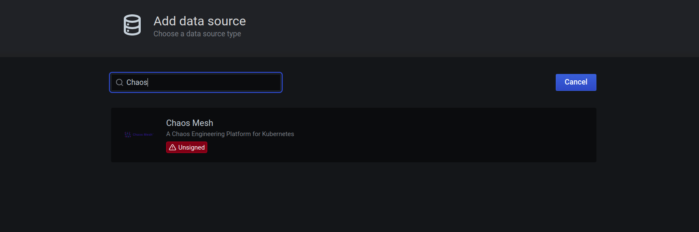

# Chaos Mesh Data Source

Visualize Chaos Mesh Events with Grafana


## Getting Started

### Use Grafana image with Chaos Mesh data source

Since Chaos Mesh data source is not officially released, it is not supported to install it from [Grafana Plugins Hub](https://grafana.com/grafana/plugins).

But you can still try to use the customized Grafana Docker image, with the Chaos Mesh data source built-in.

```bash
docker pull yeya24/grafana:chaos
```

### Development

You need to install the following first:

- [yarn](https://yarnpkg.com/)
- [Docker Compose](https://docs.docker.com/compose/)

1. Install dependencies
```BASH
yarn install
```
2. Build plugin in development mode or run in watch mode
```BASH
yarn dev
```
or
```BASH
yarn watch
```
3. Build plugin in production mode
```BASH
yarn build
```

### Develop using Docker Compose

First build the data source locally

```bash
yarn dev
```

You can develop using Docker Compose easily.

```bash
docker-compose up -d
```

Then you can open `localhost:3000` at the browser and find the Chaos Mesh data source.



Remember that every time the source code changes, you need to restart the Grafana container to load the latest plugin.

## Learn more
- [Chaos Mesh Repository](https://github.com/pingcap/chaos-mesh)
- [Chaos Mesh Website](https://chaos-mesh.org/)
- [Build a data source plugin tutorial](https://grafana.com/tutorials/build-a-data-source-plugin)
