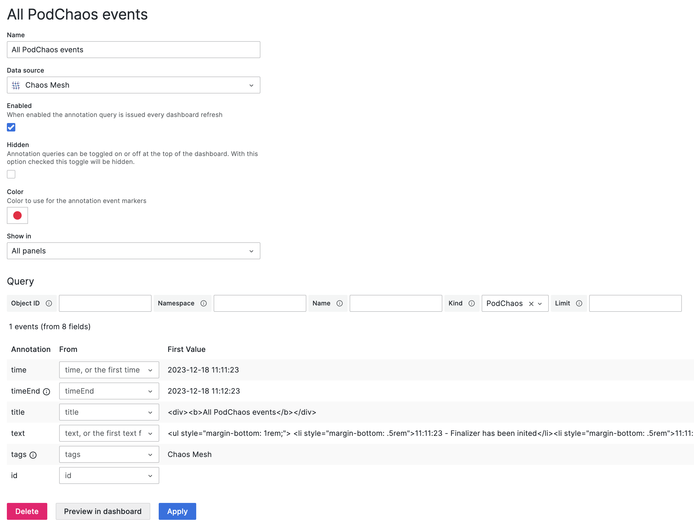
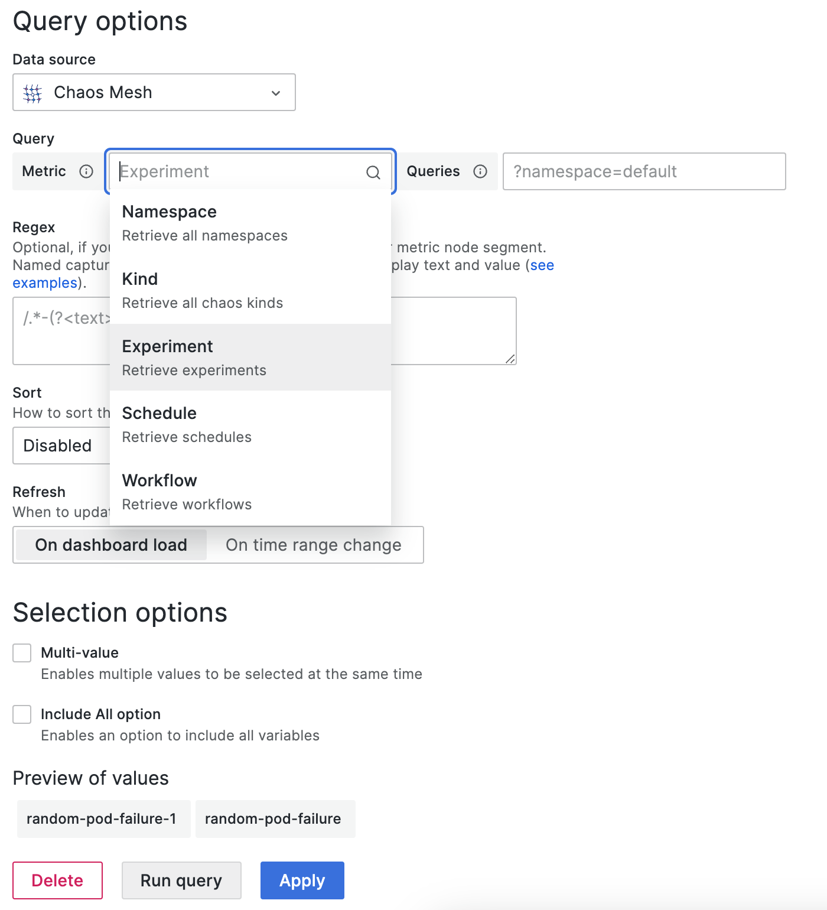

# Data Source

Grafana data source plugin for Chaos Mesh.

> Require: Chaos Mesh >= **2.0.0**, Grafana >= **7.0.0**

## Features

- Visualize Chaos Events on the table
- Show Chaos Events on the graph with [Annotations](https://grafana.com/docs/grafana/latest/dashboards/annotations/)
- Display different Chaos Events by [Variables](https://grafana.com/docs/grafana/latest/variables/)

## Installation

```sh
grafana-cli plugins install yeya24-chaosmesh-datasource
```

For more installation options, refer: <https://grafana.com/docs/grafana/latest/plugins/installation>.

## Setup

After installed, you can add it in **Configuration -> Data sources**, then you will enter the settings page:


Only the `URL` field needs to be filled in and the others can be ignored.

Assuming you have a local Chaos Mesh installed, the dashboard will default export its API in port `2333`. So, if you don't modify anything, you can simply fill `http://localhost:2333` into it.

Then use **port-forward** to active:

```sh
kubectl port-forward -n chaos-testing svc/chaos-dashboard 2333:2333
```

Finally, click **Save & Test** to test the connection. If it shows that the connection is successful, then the setup work has been completed.

## Query

There will be several options to be responsible for filtering events:

- **Object ID** - Filter by object uuid
- **Namespace** - Filter by different namespace
- **Name** - Filter by object name
- **Kind** - Filter by kind (PodChaos, Schedule...)
- **Limit** - Limit the number of events

## Annotations

Edit example:



For usage, you can refer to the content described by [Query](#query).

## Variables

If you choose the type to `Query` and select the data source to `Chaos Mesh`, You can retrieve
the variables by four different metrics:



- Namespace

  After selection, all available namespaces will show in **Preview of values** directly. Without other operations.

- Kind

  Same as **Namespace**. Get all kinds.

- Experiment

  Same as **Namespace**. Get the names of all experiments.

- Schedule

  Same as **Namespace**. Get the names of all schedules.

## How to contribute

Pull a request or open an issue to describe your changes or problems.

## License

Same as Chaos Mesh. Under Apache-2.0 License.
